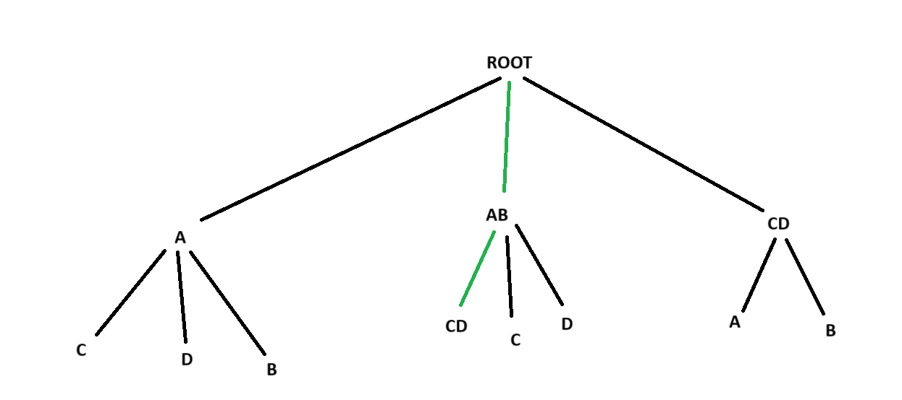
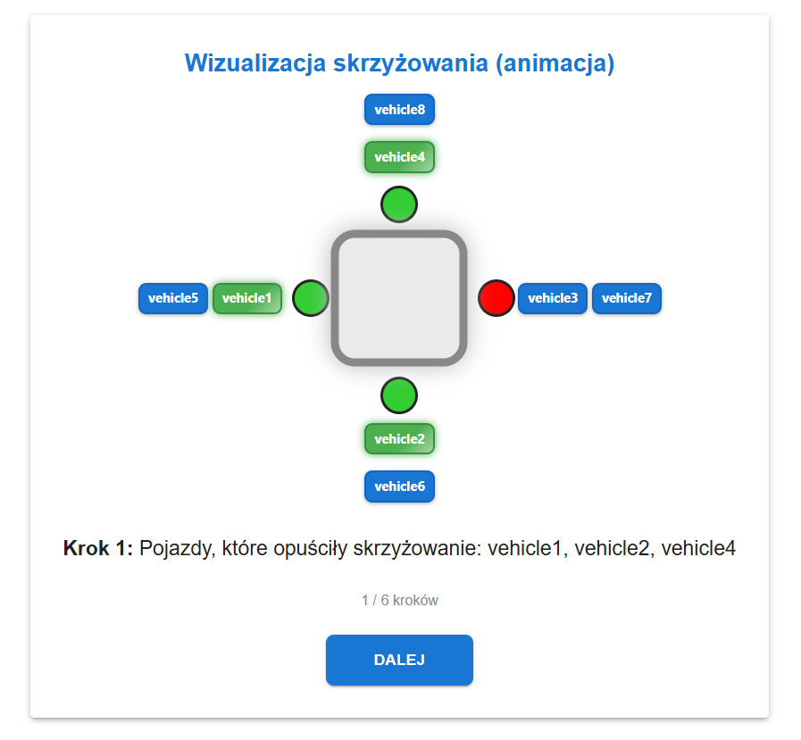
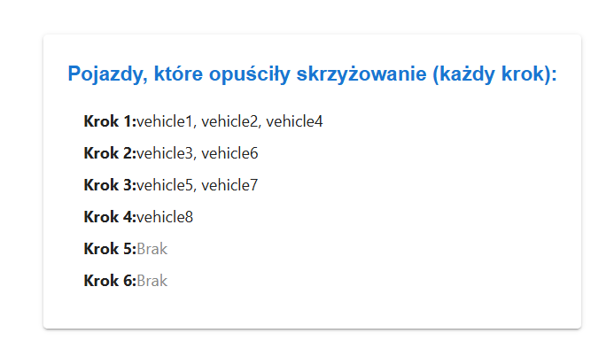

# 🚦 Intelligent Traffic Light Simulator

Symulacja inteligentnych świateł drogowych z graficznym i tekstowym interfejsem użytkownika.  
Projekt wspiera tryby symulacji oparte na **drzewie decyzyjnym** lub algorytmie **maksymalnej grupy pojazdów**, które mogą bezpiecznie przejechać przez skrzyżowanie.

---

## 📁 Struktura projektu

```bash
project-root/
    ├── frontend/                       # Interfejs graficzny (React)
    │
    ├── main/                           # Główna aplikacja Java
    │   ├── api/                        # REST API (Spring Boot)
    │   ├── cli/                        # Logika CLI (Picocli)
    │   ├── io/                         # Parsowanie JSON-ów (wejście/wyjście)
    │   ├── model/                      # Modele danych: Vehicle, Direction itp.
    │   └── simulation/                 # Silniki i logika symulacji skrzyżowania
    │
    └── test/                           # Testy jednostkowe (JUnit)
```

## 🧪 Uruchamianie z linii komend (CLI)

#### Dostępne opcje:
```less
Usage: traffic-sim [-hV] [--serve] [--engine=<engineType>] [--input=<input>]
                   [--max-depth=<maxDepth>] [--output=<output>]
                   [--simultaneous-decisions=<simultaneousDecisions>]
  -h, --help                         Show help
  -V, --version                      Show version
      --serve                        Uruchom backend (Spring Boot)
      --input=<input>               Ścieżka do pliku wejściowego (JSON)
      --output=<output>             Ścieżka do pliku wyjściowego (JSON)
      --engine=MAX_GROUP|DECISION_TREE
                                    Wybór algorytmu symulacji
      --max-depth=<int>             Głębokość drzewa decyzyjnego (jeśli używane)
      --simultaneous-decisions=<int>
                                    Liczba dzieci dla każdego węzła (jeśli używane)
```

## ⚙️ Tryb: --engine=MAX_GROUP - szybki ale mniej wydajny

```bash
java -jar traffic-sim.jar --input input.json --output output.json --engine MAX_GROUP
```
### 🧠 Zasada działania
1. Dla każdego kroku pobierane są pojazdy ustawione na przodzie kolejek (frontVehicles) z każdej drogi (N, S, E, W).

2. Z wszystkich możliwych podzbiorów tych pojazdów wyszukiwany jest największy zestaw pojazdów, które:
  - mogą przejechać jednocześnie,
  - nie kolidują ze sobą (logika kolizji uwzględnia kierunki jazdy i pieszych).

3. Ten zestaw przejeżdża przez skrzyżowanie, reszta czeka.

## 🌲 Tryb: --engine=DECISION_TREE - wolniejszy ale bardziej efektywny

Tryb `DECISION_TREE` wykorzystuje drzewo decyzyjne do planowania przejazdów przez skrzyżowanie tak, aby **zmaksymalizować liczbę pojazdów**, które mogą opuścić skrzyżowanie w kilku kolejnych krokach.

#### ⚙️ Parametry
|         Parametr         |Wartość domyślna|Opis|
|:------------------------:|:-------:|:-------:|
|       --max-depth        |4|Maksymalna liczba kroków, jakie rozważa drzewo|
| --simultaneous-decisions |4|Maksymalna liczba dzieci (możliwych grup przejazdu) w węźle|

```bash
java -jar traffic-sim.jar \
  --input=input.json \
  --output=output.json \
  --engine=DECISION_TREE \
  --max-depth=6 \
  --simultaneous-decisions=5
```

### 🧠 Zasada działania
1. W danym momencie analizowane są pojazdy znajdujące się na początku kolejek (frontVehicles).

2. Na podstawie nich budowane jest drzewo decyzji:
   - Każdy węzeł to możliwa grupa pojazdów, które mogą przejechać jednocześnie bez kolizji.
   - Dzieci węzła to kolejne możliwe przejazdy po usunięciu grupy z rodzica.
   - Drzewo jest budowane do określonej głębokości (--max-depth).

3. Spośród wszystkich możliwych ścieżek w drzewie wybierana jest ta, która:
   - umożliwia przejazd największej liczbie pojazdów, a jeśli jest remis:
   - wybierana jest ścieżka o najmniejszej głębokości (czyli szybsza realizacja).


> Zdjęcie pokazuje wybór najoptymalniejszej drogi spośród 4 aut: A,B,C oraz D stojących na skrzyżowaniu

### Koszt obliczeniowy
Drzewo decyzyjne budowane przez algorytm symulacji działa podobnie jak klasyczne drzewo n-arnalne:
- każdy węzeł odpowiada grupie pojazdów, które mogą przejechać bez kolizji,
- każdy poziom (głębokość) analizuje kolejne możliwe decyzje ruchu,
- każde dziecko to inna możliwa kontynuacja ruchu po wybraniu grupy z rodzica.

**Jeśli:**
- d = głębokość drzewa (max-depth)
- k = liczba dzieci w każdym węźle (simultaneous-decisions)

**$\text{Total Nodes = } \Sigma^{d}_{i=1} k^{i}$**

|  `max-depth`  | `simultaneous-decisions` |Liczba węzłów (~) |
|:-----------:|:------------------------:|:----------------:|
| 2 | 2 | 7 |
| 3 | 3 | 40 |
| 4 | 4 | 341 |
| 5 | 5 | 3905 |
| 6 | 6 | 55987 |

#### 🚨 Co to oznacza w praktyce?
- Duża głębokość = lepsze decyzje, ale bardzo wolne obliczenia
- Więcej dzieci = więcej ścieżek, większy koszt pamięci


## 🔧 Backend (Spring Boot + symulacja)
Backend to lekka aplikacja serwerowa zbudowana w Spring Boot, która wystawia REST API do obsługi symulacji.
### Uruchomienie backendu
```bash
java -jar traffic-sim.jar --serve
```

### Endpointy API

|  Metoda  | Endpoint |                 Zapytanie                 | Odpowiedź |
|:-----------:|:------------------------:|:-----------------------------------------:|:---------:|
| POST | /api/simulation | Wysyła zestaw komend do silnika symulacji | Odsyła listę gotowych kroków symulacji |

### 📦 Przykład użycia API
**Request:**
```http request
POST /simulate
Content-Type: application/json

{
  "commands": [
    { "type": "addVehicle", "vehicleId": "v1", "startRoad": "north", "endRoad": "south" },
    { "type": "step" }
  ]
}
```
**Response:**
```json
{
  "stepStatuses": [
    { "leftVehicles": ["v1"] }
  ]
}
```

## 🌐 Frontend (React)

Interaktywny frontend aplikacji umożliwia użytkownikowi wizualne sterowanie i obserwowanie działania symulacji skrzyżowania. Zbudowany został w technologii React z wykorzystaniem bibliotek do wizualizacji i interakcji.

### ▶️ Jak uruchomić frontend
1. Wejdź do katalogu:
```bash
cd frontend
```
2. Zainstaluj zależności:
```bash
npm install
```
3. Uruchom aplikację:
```bash
npm start
```
Aplikacja zostanie uruchomiona pod adresem:
http://localhost:5173/






